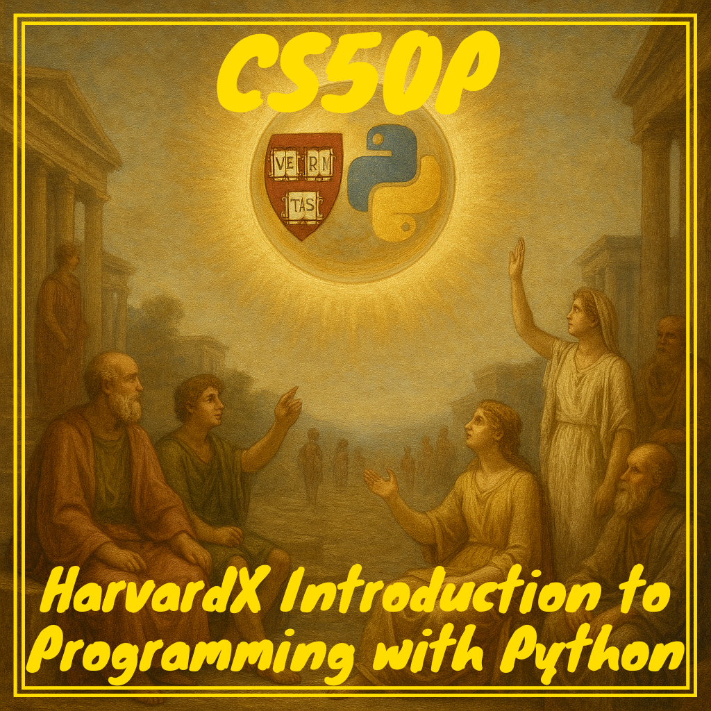

<p align="center">
  
</p>

## 🚀 CS50P: Introduction to Programming with Python

This repository contains my solutions and notes for Harvard's CS50P: Introduction to Programming with Python.

Each week explores a new programming concept, building foundational skills in Python through hands-on projects and exercises.

---

## 📚 WEEKLY OVERVIEW

### Week 0: Basics & Functions
- **Concepts:** Input/output, variables, basic arithmetic, string manipulation, and defining simple functions.
- **Sample Projects:**
  - `einstein.py`: Calculate Einstein's energy-mass equivalence.
  - `faces.py`: Replace text emoticons with emoji.
  - `indoor.py`: Convert text to lowercase.
  - `playback.py`: Slow down user input.
  - `tip.py`: Calculate a tip based on user input.

### Week 1: Conditionals & Loops
- **Concepts:** Boolean logic, if/elif/else, while loops, and user input validation.
- **Sample Projects:**
  - `bank.py`: Respond to greetings with different outputs.
  - `deep.py`: Print a phrase a set number of times.
  - `extensions.py`: File extension recognition.
  - `interpreter.py`: Simple arithmetic interpreter.
  - `meal.py`: Meal time checker.

### Week 2: Loops, Lists & Dictionaries
- **Concepts:** For/while loops, lists, dictionaries, and basic data validation.
- **Sample Projects:**
  - `camel.py`: Convert snake_case to camelCase.
  - `coke.py`: Simulate a vending machine.
  - `nutrition.py`: Look up nutrition facts.
  - `plates.py`: Validate vanity license plates.
  - `twttr.py`: Shorten text by removing vowels.

### Week 3: Exceptions & File I/O
- **Concepts:** Exception handling, reading/writing files, and user input errors.
- **Sample Projects:**
  - `fuel.py`: Fuel gauge with error handling.
  - `grocery.py`: Grocery list manager.
  - `outdated.py`: Check for outdated software.
  - `taqueria.py`: Menu ordering system.

### Week 4: Libraries & APIs
- **Concepts:** Using external libraries, APIs, and command-line arguments.
- **Sample Projects:**
  - `adieu.py`: Print a goodbye message.
  - `bitcoin.py`: Get Bitcoin price from an API.
  - `emojize.py`: Convert text to emoji using a library.
  - `figlet.py`: ASCII art generator.
  - `game.py`: Number guessing game.
  - `professor.py`: Math quiz generator.

### Week 5: Unit Testing
- **Concepts:** Writing and running tests with `pytest`, test-driven development, and code coverage.
- **Sample Projects:**
  - `test_bank/`, `test_fuel/`, `test_plates/`, `test_twttr/`: Automated tests for previous weeks' projects.
  - `_practice/calculator/`: Simple calculator with tests.

### Week 6: File Handling & CSV
- **Concepts:** Reading/writing CSV files, working with data, and file manipulation.
- **Sample Projects:**
  - `lines.py`: Count lines in a file.
  - `pizza.py`: Read pizza menu from CSV.
  - `scourgify.py`: Clean up CSV data.
  - `shirt.py`: Overlay images using PIL.

### Week 7: Regular Expressions
- **Concepts:** Regex for pattern matching, data validation, and parsing.
- **Sample Projects:**
  - `numb3rs.py`: Validate IPv4 addresses.
  - `response.py`: Validate user responses.
  - `um.py`: Count "um" in text.
  - `watch.py`: Validate time formats.
  - `working.py`: Convert time ranges.

### Week 8: Object-Oriented Programming
- **Concepts:** Classes, objects, methods, and encapsulation.
- **Sample Projects:**
  - `jar.py`: Simulate a cookie jar class.
  - `seasons.py`: Calculate minutes from birthdate.
  - `shirtificate.py`: Generate a certificate image.

---

## ⚙️ USAGE

1. **Clone the repository:**
   ```bash
   git clone https://github.com/maitreverge/CS50P.git
   ```
2. **Navigate to the project directory:**
   ```bash
   cd CS50P
   ```
3. **(Optional) Set up a Python virtual environment:**
   ```bash
   source ./p_env.sh master
   ```
   > [!NOTE]
   > The `p_env.sh` script manages Python virtual environments and dependencies.
   > For help, run: `./p_env.sh -h`
4. **Run any script:**
   ```bash
   python week_X/project_name/project.py
   ```
   Replace `X` and `project_name` as needed.

## 🗂️ PROJECT STRUCTURE

- **week_0/** to **week_8/**: Weekly folders with projects and exercises.
- **img/**: Images and assets for documentation.
- **requirements.txt**: Python dependencies.
- **p_env.sh**: Virtual environment setup script.

## 🤝 CONTRIBUTING

Contributions are welcome! Open a GitHub Issue or submit a Pull Request 🚀